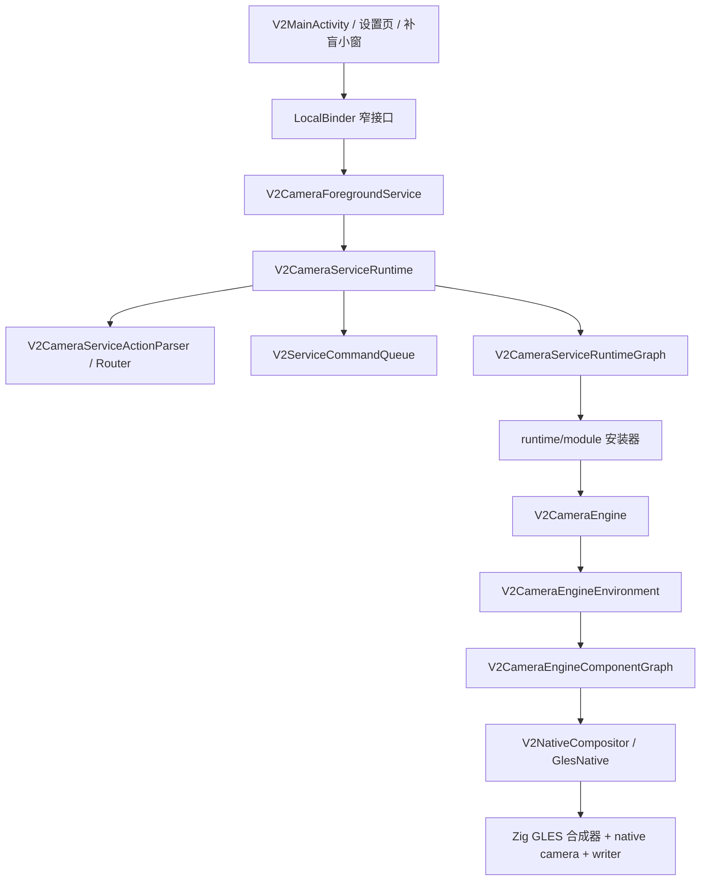

# EVCam

EVCam 是面向吉利银河车机的 V2 行车记录仪应用。当前主线是 Kotlin V2 架构，通过前台服务驱动多路车载摄像头预览、录制、补盲小窗、鱼眼矫正、避让、开机自启和保活。

## 当前状态

- App namespace: `com.kooo.evcam`
- 安装包名: `com.kooo.evcam.v2`
- 模块: `:app`、`:core:model`
- 当前版本: `2.0.0-test-05091630`
- 最低 SDK: 28
- target / compile SDK: 36
- Native ABI: `arm64-v8a`
- Release 签名: 使用 `keystore/release.jks` 中已配置的测试签名

## 功能

- 四路摄像头合成预览和 H.264 分段录制。
- Zig native GLES 合成器，负责 EGL/OES 输入、预览 worker、编码器 Surface 渲染和 native 分段写入。
- 主预览、鱼眼预览、补盲预览 Surface 所有权管理，支持优先级抢占。
- 预览/录制鱼眼参数与补盲鱼眼参数独立配置。
- 转向灯 VHAL 事件驱动补盲小窗。
- 补盲画面二级校正，支持缩放、平移、旋转调节。
- 前台应用避让：隐藏 UI、停止/恢复录制、隐藏补盲、自动录制恢复。
- 屏幕关闭/点亮处理：释放/重连摄像头，延迟恢复录制。
- 前台服务、开机广播、保活 worker/provider/receiver、唤醒锁、无障碍保活。
- Flyme Auto 状态栏插件和自定义按键 VHAL 控制。
- 视频回放缓存和存储清理。
- 设置页支持车型、权限、启动、录制、存储清理、自定义按键、避让、鱼眼、补盲。

## 支持车型预设

当前车型预设位于 `V2VehicleModelSettings`：

| 预设 | 前 | 后 | 左 | 右 |
| --- | --- | --- | --- | --- |
| `银河E5` | `2` | `1` | `3` | `0` |
| `26款星舰7` | `3` | `2` | `4` | `1` |
| `银河A7(带智驾)` | `2` | `1` | `3` | `0` |
| `自定义` | 用户自定义 | 用户自定义 | 用户自定义 | 用户自定义 |

默认预设是 `银河A7(带智驾)`。支持自定义摄像头映射，用户可在设置中为前后左右分别指定摄像头 ID。

## 构建环境

- JDK 17+
- Android Gradle Plugin 9.0.0
- Gradle wrapper 9.1.0
- Android SDK / build tools for compile SDK 36
- Android NDK `28.2.13676358`
- CMake `3.22.1`
- `zig` 需要在 `PATH` 中可用

`:app` 必须构建 native 部分。CMake 会在 `app/src/main/zig` 下调用 `zig build`。

## 构建命令

macOS / Linux:

```bash
./gradlew :app:assembleDebug
./gradlew :app:assembleRelease
./gradlew :app:compileDebugKotlin
./gradlew :app:testDebugUnitTest :app:assembleDebug
```

Windows:

```bat
gradlew.bat :app:assembleDebug
gradlew.bat :app:assembleRelease
gradlew.bat :app:testDebugUnitTest
```

APK 输出位置：

```text
app/build/outputs/apk/debug/app-debug.apk
app/build/outputs/apk/release/app-release.apk
```

`release.bat` 是 Windows 专用交互式发布脚本，会执行 clean release 构建、重命名 APK、创建并推送 `v<versionName>` 标签，再通过 GitHub CLI 创建 release。只有明确要走发布流程时再运行。

## 安装与调试

安装 debug APK：

```bash
adb install -r app/build/outputs/apk/debug/app-debug.apk
```

安装 release APK：

```bash
adb install -r app/build/outputs/apk/release/app-release.apk
```

常用日志：

```bash
adb logcat -v time -s V2MainActivity:D V2CameraService:D V2AppLog:D AndroidRuntime:E
```

查看摄像头硬件信息：

```bash
adb shell dumpsys media.camera
```

查看已安装版本：

```bash
adb shell dumpsys package com.kooo.evcam.v2 | grep versionName
```

## 运行时架构

当前应用以 Service 为中心。UI 只绑定窄接口；相机、预览、录制、屏幕电源、设置、保活、VHAL、避让、状态上报由 runtime graph 组合。



关键边界：

- `V2CameraForegroundService`: Android 前台服务外壳和 Binder 入口。
- `V2CameraServiceApi`: UI 面向的窄接口，包括录制、可见性、主预览、补盲预览。
- `V2CameraServiceContract` / `V2CameraServiceActionParser`: Service action/extra 契约和 Intent 到业务 action 的解析层。
- `V2CameraServiceRuntime`: Service 操作入口，负责把操作派发到 runtime graph。
- `V2ServiceCommandQueue`: 串行化相机、录制、屏幕电源、设置等状态迁移。
- `V2CameraServiceRuntimeGraph`: Service 组件注册表，由 `service/runtime/module/*` 负责安装。
- `V2CameraEngine`: 相机 slots、native 合成器、预览 Surface、录制控制、状态的门面。
- `V2CameraEngineEnvironment`: 相机规格、线程、录制配置和 native compositor 的初始化环境。
- `V2NativeCompositor` / `GlesNative`: Kotlin 到 Zig 合成器和录制 worker 的 JNI 桥。
- `V2StartupLaunchCoordinator`: 开机、保活、worker 的启动策略和 foreground-service fallback 入口。
- `V2FisheyeSettingsController`: 鱼眼设置页的参数保存、导入、重置和服务刷新业务层。

## 预览与录制链路

主预览：

```text
V2MainActivity
  -> V2MainPreviewBinder
  -> V2CameraServiceUiApi.attachCompositePreviewSurface
  -> V2CameraServiceRuntime
  -> V2CameraServicePreviewFacade
  -> V2CameraEngine
  -> V2NativeCompositor.attachCompositePreview
  -> Zig GLES composite preview worker
```

补盲预览：

```text
VHAL 转向灯事件
  -> V2BlindSpotController
  -> V2BlindSpotWindowCoordinator
  -> V2BlindSpotSmallWindowActivity
  -> V2BlindSpotSmallWindowServiceBinder / Intents / RevealController
  -> V2BlindSpotPreviewServiceApi.attachBlindSpotPreviewSurface
  -> V2PreviewLeaseManager owner=BLIND_SPOT
  -> native preview surface 使用补盲鱼眼参数
  -> V2BlindSpotTransform 二级画面校正
```

录制：

```text
V2RecordingOrchestrator
  -> V2CameraRecordingController
  -> V2RecordingPipelineFactory
  -> V2CompositeRecorder
  -> V2NativeRecordingBridge.startManagedRecording
  -> Zig GLES 渲染到 encoder surface
  -> AMediaCodec
  -> AMediaMuxer
  -> 分段 MP4 文件
```

当前代码没有 app 侧 Vulkan 路径。实际渲染/录制链路是 EGL + GLESv2 + OES 纹理 + Android NDK media API。

## 源码目录

```text
app/src/main/kotlin/com/kooo/evcam/v2/
  service/
    V2CameraForegroundService.kt
    V2CameraServiceApi.kt
    runtime/
    runtime/module/
    camera/
    commands/
    recording/
    preview/
    display/
    keepalive/
    avoidance/
    settings/
    status/
    vhal/
  ui/
    main/
    settings/
    blindspot/
    fisheye/
    playback/
  nativebridge/
  recording/
  storage/
  plugin/
  permissions/
  update/

core/model/src/main/kotlin/com/kooo/evcam/v2/
  service/
  settings/
  recording/
  storage/

app/src/main/zig/
  evcam_gles_compositor.zig
  evcam_writer.zig
  evcam_types.zig
  evcam_storage.zig
  evcam_playback_cache.zig
```

## 设置项

V2 设置页由 `V2SettingsActivity` 和 `ui/settings` 下的 section 类实现。

当前设置组：

- 通用：版本、保活状态、车型、权限、日志、开机启动、启动自动录制。
- 录制：分辨率、码率、帧率、分段时长。
- 存储清理：保留空间和清理策略。
- 自定义按键：车辆按键 VHAL 属性。
- 避让：前台目标检测和行为掩码。
- 鱼眼：预览/录制鱼眼参数、补盲鱼眼参数。
- 补盲：转向灯属性、补盲画面校正、小窗行为。

设置变化通过 `V2CameraServiceCommands` 发送，由运行中的 `V2SettingsRuntimeCoordinator` 应用。

鱼眼设置页的业务动作集中在 `V2FisheyeSettingsController`，UI section 只负责控件创建和事件绑定。补盲小窗的 Service 绑定、Intent 目标解析、窗口 reveal、Flyme 小窗 task 清理和变换读取分别由 `V2BlindSpotSmallWindowServiceBinder`、`V2BlindSpotSmallWindowIntents`、`V2BlindSpotSmallWindowRevealController`、`V2BlindSpotSmallWindowTaskCleaner`、`V2BlindSpotSmallWindowTransformStore` 承担。

## 权限与系统集成

应用使用相机、媒体/存储、前台服务、唤醒锁、开机广播、通知、悬浮窗、使用情况访问、任务访问、无障碍保活、蓝牙状态、Flyme Auto 插件、车辆/屏幕广播等能力。

修改 `AndroidManifest.xml` 时要谨慎，以下组件都与车机运行行为有关：

- `V2CameraForegroundService`
- `V2BootReceiver`
- `V2KeepAliveReceiver`
- `V2KeepAliveProvider`
- `V2KeepAliveAccessibilityService`
- `V2DisplayPowerReceiver`
- `V2StatusBarPlugin`
- `V2StatusBarPluginReceiver`
- `V2BlindSpotSmallWindowActivity`

## 开发规则

- 不把业务逻辑放进 `V2MainActivity`，应放到 service/runtime/UI helper 中。
- Android app 逻辑留在 `:app`；共享 DTO/settings model 放到 `:core:model`。
- 代码变更后更新 `app/build.gradle.kts` 的 `versionName`，格式为 `-test-MMddHHmm`。
- UI 与 Service 通信优先使用 `V2CameraServiceApi` 中的窄接口。
- Kotlin 侧跨 JNI 前先把 native bridge 参数结构化。
- 代码变更至少运行：

```bash
./gradlew :app:compileDebugKotlin
./gradlew :app:testDebugUnitTest :app:assembleDebug
```

## 排障

摄像头无法启动：

- 检查 `adb shell dumpsys media.camera`。
- 确认当前车型摄像头映射。
- 检查 `V2CameraEngine` 和 native compositor 日志。
- 确认屏幕电源状态没有释放摄像头。

录制失败：

- 确认所有预期 camera slot 已打开。
- 检查存储路径和剩余空间。
- 检查 `V2NativeCompositor.lastError()` 的 native 错误。
- 查看 `V2CompositeRecorder` 和 `EVCamGLES` 日志。

补盲预览不显示：

- 确认设置中已启用补盲。
- 确认转向灯 VHAL 属性和值。
- 检查避让行为；避让激活时可能抑制补盲小窗。
- 查看 `V2BlindSpotSmallWindow` 和 `V2CameraService` 日志。

鱼眼变化不生效：

- 确认改的是正确参数组：预览/录制鱼眼，还是补盲鱼眼。
- 设置变化应通过 `ACTION_SETTINGS_CHANGED` 和 `V2SettingsRuntimeCoordinator` 生效。
- 补盲预览会先使用补盲鱼眼数组，再执行 UI 层补盲画面校正。

## License

GPL-3.0. See [LICENSE](LICENSE).
